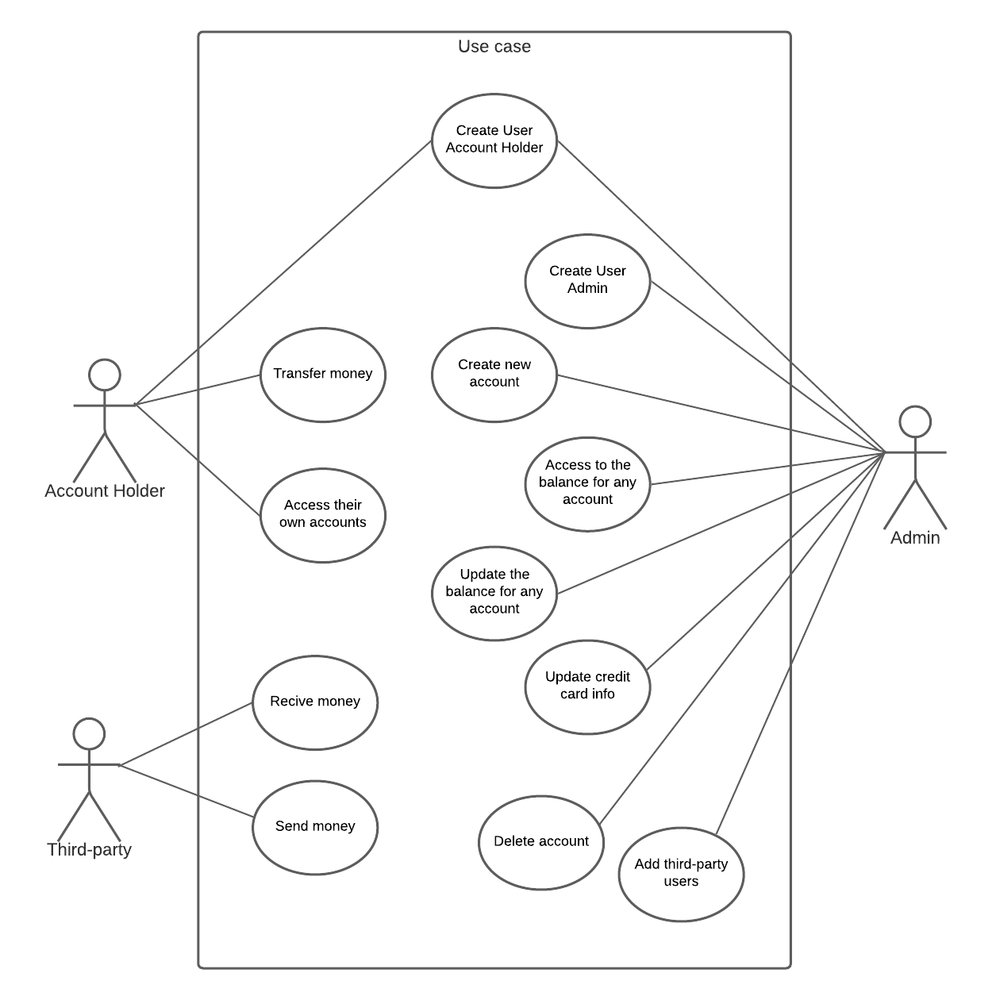
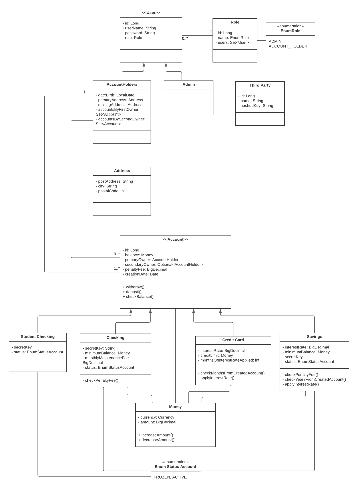

# PROYECTO FINAL BOOTCAMP BACKEND IRONHACK
## Banking system

Proyecto realizado con spring boot donde se crea una API simple de un sistema bancario incorporando seguridad básica y testing.
Cómo dependencias a destacar se han usado:
- spring-boot-starter-web
- spring-boot-devtools
- mysql-connector-java
- spring-boot-starter-data-jpa
- spring-boot-starter-validation
- spring-boot-starter-security
- lombok
- jackson-datatype-jsr310

## INICIO
La applicación está por defecto conectada a un servidor local de mySQL apuntando a los esquemas *systembank* y *testbank*
(para testing).

Al iniciar la app se insertan automáticamente usando CommandLineRunner los siguientes valores en la base de datos:

#### Roles
- ADMIN
- ACCOUNT_HOLDER

#### Usuarios
- Usuario tipo **Admin** con rol ADMIN
  - Name: maria
  - Password: password*
  

- Usuarios tipo **AccountHolder** con rol ACCOUNT_HOLDER
  - User1
    - UserName: pepe
    - Password: password*
  - User2
    - UserName: antonia
    - Password: password*
  
*Se ha puesto la misma contraseña a los tres usuarios para simplificar.

#### Cuentas
- Cuenta tipo **Savings** vinculada a *user1*
  - Balance: 3000
  - SecretKey: secretKey*
  

- Cuenta tipo *Savings* vinculada a *user2*
  - Balance: 1500
  - SecretKey: secretKey*

*Se ha puesto la misma contraseña a las dos cuentas para simplificar.

### FUNCIONAMIENTO

Existen dos roles con diferentes accesos permitidos:

El rol ADMIN se vincula a los usuarios tipo **Admin** y el rol ACCOUNT_HOLDER a los tipo **AccountHolder**.

#### ENPOINTS
#### *ADMIN*
- POST /thirdparty/new
  - Crea un **ThirdParty**.
- POST /accounts/new/savings
  - Crea una cuenta tipo **Savings**
- POST /accounts/new/creditcard
  - Crea una cuenta tipo **CreditCard**
- POST /accounts/new/checking
  - Crea una cuenta tipo **Checking**, si el primaryOwner de la cuenta es menor de 24 años se crea una cuenta tipo
  **StudentChecking** de forma automática.
- GET /account/balance/{id}
  - Acceso al balance de todas las cuentas.

#### *ACCOUNT HOLDER*
- GET /account/balance/{id}
  - Acceso al balance de sus propias cuentas. 
- PATCH /account/transfer/{id}
  - Si hay suficientes fondos realiza una transferencia de una de sus cuentas a otra cuenta (suya o no).

####  *ACCESO PÚBLICO*
  - POST /users/new/accountholder
    - Crea un nuevo **AccountHolder**

####  *OTRO*
- PATCH /thirdparty/deposit
  - Realiza un depósito a una cuenta en concreto. Para permitir la operación es necesario pasar un hashedKey válido
  por el header de la petición HTTP. *Ver más detalles. (vincular link).

    

## DOCUMENTATION

### Swagger
[http://localhost:8080/swagger-ui/index.html](http://localhost:8080/swagger-ui/index.html)*

*Acceder una vez iniciada la applicación.

### Diagrama de caso de uso

### Diagrama de clases

## DETALLES

### Third party
Puede recibir y enviar dinero a otras cuentas.

Las **ThirdParty** son creadas por los usuarios con rol ADMIN, para ello deben aportar simplemente un nombre.
Una vez verificado que el nombre no está repetido en la base de datos se crea un código hashedKey que se devuelve 
como respuesta a la petición http.

Este código es necesario para poder hacer las transferencias vía *thirdParty* ya qué hay que proporcionarlo en el header
de la petición http correspondiente.

### Savings
**Propiedades**
- balance: proporcionado por el usuario.
- secretKey: proporcionado por el usuario.
- PrimaryOwner: proporcionado por el usuario.
- optional SecondaryOwner: proporcionado por el usuario.
- minimumBalance: rango entre 100 y 1000. Por defecto es 1000.
- penaltyFee: 40.
- creationDate: se vincula de forma automática al crear la cuenta.
- status (FROZEN, ACTIVE): se aplica el ACTIVE por defecto.
- Interest rate: cómo máximo permitido 0.5. Por defecto es de 0.0025.

### CreditCards
- balance: proporcionado por el usuario.
- PrimaryOwner: proporcionado por el usuario.
- optional SecondaryOwner: proporcionado por el usuario.
- creditLimit: rango entre 100 y 100000. Por defecto es 100.
- interestRate: rango entre 0.1 y 0.2. Por defecto es 0.2
- penaltyFee: 40

### CheckingAccounts
**Propiedades**
- balance: oroporcionado por el usuario.
- secretKey: proporcionado por el usuario.
- PrimaryOwner: proporcionado por el usuario.
- optional SecondaryOwner: proporcionado por el usuario.
- minimumBalance: 250.
- penaltyFee: 40.
- monthlyMaintenanceFee: 12.
- creationDate: se vincula de forma automática al crear la cuenta.
- status (FROZEN, ACTIVE): se aplica el ACTIVE por defecto.

Cuando el balance de una cuenta cae por debajo del balance mínimo se
deduce el penaltyFee automáticamente cada vez que se accede a ella (transacciones, ver balance).

Si el titular de la cuenta es menor de 24 años se crea una cuenta tipo
**StudentCheckingAccount*** automáticamente que no tiene *monthlyMaintenanceFee* ni *minimumBalance*.

## Aclaraciones
El método checkBalance de Account, aplica el penalty fee cada vez que el usuario accede a su balance y 
aplica el interest rate en savings anual. 
el método withdraw aplica el penalty fee en caso necesario cada vez que se retira dinero de la cuenta.